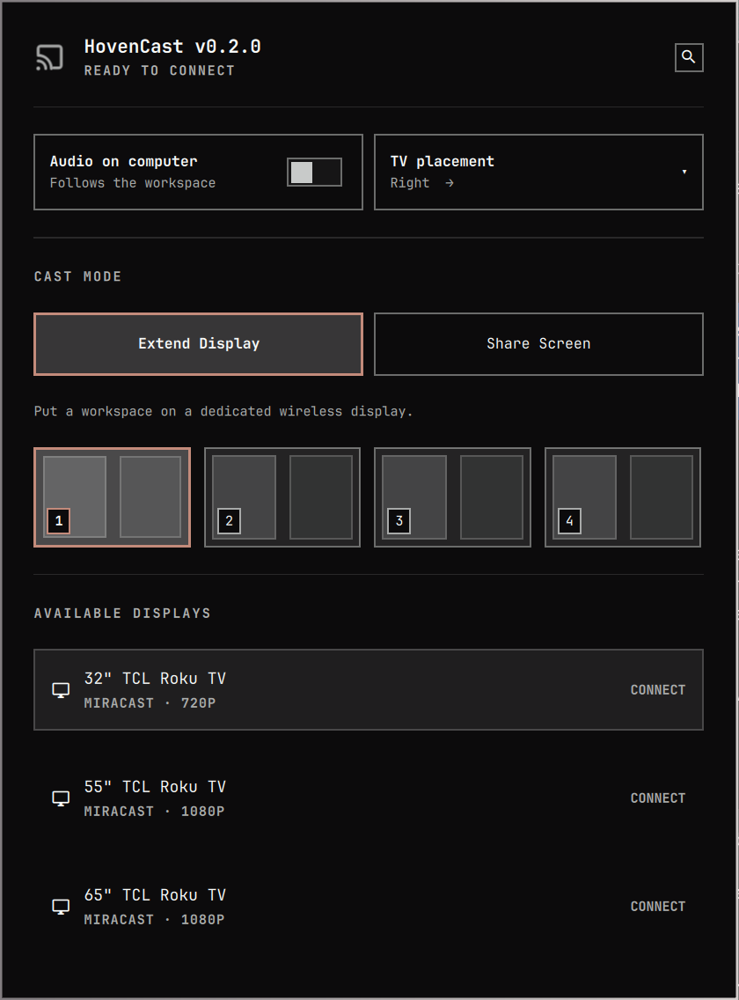
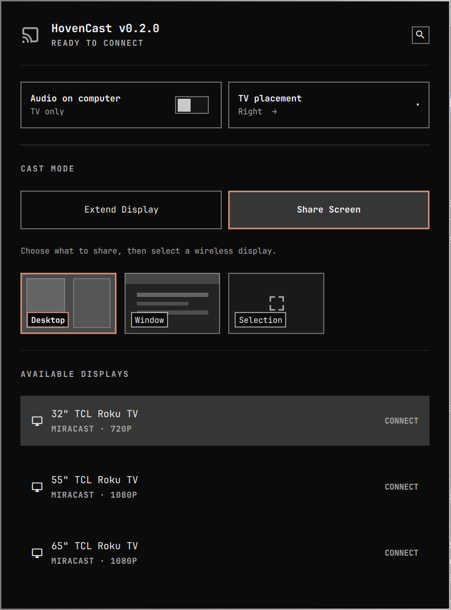

# HovenCast

HovenCast is an Omarchy bar plugin that turns a compatible Roku TV into a
wireless Hyprland display. It can place a workspace on a dedicated TV display,
or share a desktop, application window, or selected area with desktop audio
over the same local network.

Version 0.2.0 uses Miracast over Infrastructure (MICE). It has been physically
tested with TCL Roku models 32S331, 55S405, and 65S451. Other Roku TVs that
advertise MICE and provide valid Roku device information are shown as
compatible candidates, but still need community testing. Fire TV, Wi-Fi
Direct, Google Cast, AirPlay, and non-Roku receivers are not supported.

## Screenshots

| Extend Display | Share Screen |
| --- | --- |
|  |  |

## Requirements

- A current Omarchy installation using the Quattro shell and Hyprland portal.
- A Roku TV with **Settings → System → Screen mirroring → Screen mirroring
  mode** set to Prompt or Always allow. Models other than the three listed
  above are community-tested rather than confirmed.
- The computer and TV on the same LAN, with multicast discovery available.
- An Arch package mirror reachable during setup if any dependency is missing.

The setup script installs missing packages through `omarchy pkg add`, builds the
small WFD/RTSP helper from included C source, and configures
`xdg-desktop-portal-hyprland` to use HovenCast's source picker. No prebuilt binary
or recording is included.

## Install

Version 0.2.0 uses HovenCast-only setup commands and runtime paths. Before
installing it over an earlier build, run that build's bundled uninstaller and
remove the installed plugin.

```sh
omarchy plugin add https://github.com/lockinflow-sudo/hovencast.git --enable
~/.config/omarchy/plugins/hoven.cast/hovencast-setup
```

Setup changes `~/.config/hypr/xdph.conf` and restarts the user portal services.
The prior values and a full pre-install copy are stored under
`${XDG_STATE_HOME:-~/.local/state}/hovencast/` for safe removal.
Setup changes only `custom_picker_binary`; it preserves your existing
`allow_token_by_default` preference.

## Use

Click the cast icon in the Omarchy bar. HovenCast searches for compatible Roku
TVs on the local network. Hover over a TV to see its network address and
connection type, then choose one after selecting the content you want to show.
Approve the sender on the TV when Roku asks.

### Extend Display

**Extend Display** gives the TV its own Hyprland output and puts one normal
workspace on it. The TV is an additional desktop rather than a copy of the
laptop screen.

1. Open **TV placement** and choose **Left**, **Above**, **Below**, or **Right**
   to match the TV's physical location.
2. Select one of the live workspace previews.
3. Select a Roku TV from **Available Displays**.
4. Move the pointer through the matching laptop edge to enter the TV. For
   example, a TV set to **Above** is reached through the top edge only.

The selected workspace becomes the TV workspace. Use Omarchy's normal
**Super+Shift+number** shortcut to move the active window to that workspace, or
**Super+Shift+Alt+number** to move it there without following it. Move the
window to a laptop workspace to bring it back. HovenCast first switches the
laptop to a fallback workspace if the selected TV workspace was visible there.

While casting, select another workspace preview to change the workspace shown
on the TV without reconnecting. **Control TV** focuses the TV display and
**Return to laptop** restores laptop focus. Omarchy's **Ctrl+Alt+Tab** and
**Ctrl+Alt+Shift+Tab** monitor shortcuts provide the same controls even after
the panel closes.

The virtual output uses the receiver's supported mode, including 1280 × 720 on
the TCL Roku 32S331, at scale 1. Applications therefore receive a real TV-sized
fullscreen layout without changing the laptop display. The selected placement
is saved for later sessions.

### Share Screen

**Share Screen** sends existing laptop content to the TV without creating a
second desktop. Choose the source first, then choose a Roku TV:

- **Desktop** shares the active display.
- **Window** opens a visual picker with live application thumbnails. Select a
  window, return to the main panel, and choose a TV. HovenCast follows the
  window as it moves or changes size.
- **Selection** opens the area selector. Drag over the part of the screen to
  share, then choose a TV when the HovenCast panel returns.

**TV placement** remains available in Share Screen so it can be set before the
next Extend Display session. Screen sharing mirrors selected content and does
not create another pointer destination.

Window sharing captures the selected monitor and crops the outgoing video to
the chosen window. Other content on that monitor is processed locally even
though it is outside the transmitted crop, so keep sensitive windows on a
different monitor when needed. The HovenCast portal picker is system-wide while
the plugin is installed and can also appear for screen-sharing requests from
other applications.

### Audio, status, and stopping

With **Audio on computer** off, Extend Display sends audio from applications on
the TV workspace to the TV, while Share Screen sends session audio to the TV.
Turn it on before connecting to hear the same audio on the computer and TV.
The status header shows connection progress, the active TV, and the live
bitrate; streaming details appear near the bottom of the panel.

Right-click the HovenCast bar icon to stop, or reopen the panel and use the stop
button in the header. HovenCast restores the prior audio sink, workspace
placement, and focus after a normal stop. A detached guard restores the
workspace and removes the virtual output if the backend crashes, and the next
HovenCast command also recovers stale state.

The workspace controller is also available from a terminal:

```sh
omarchy-cast workspace-list
omarchy-cast workspace set 4
omarchy-cast workspace focus-tv
omarchy-cast workspace focus-local
```

## Remove

Restore the external portal setting before deleting the plugin:

```sh
omarchy plugin disable hoven.cast
~/.config/omarchy/plugins/hoven.cast/hovencast-uninstall
omarchy plugin remove hoven.cast
```

The uninstaller restores only values still owned by HovenCast. If you changed a
managed value after setup, it leaves that value alone instead of overwriting
your newer configuration.

`omarchy plugin remove` does not run plugin uninstall hooks. If the plugin was
removed first, clone the same release again and run `./hovencast-uninstall`; its
restore state is kept outside the plugin directory.

## Privacy and files

HovenCast streams directly to the selected TV on the local network and does not
upload the capture. Its RTSP listener binds only to the receiver-facing local
address and rejects connections not originating from the selected TV. It does
not save screen recordings. Any portal picker preview is deleted as soon as
selection ends. A small newline-delimited diagnostic event log is replaced for
each session under `$XDG_RUNTIME_DIR/hovencast/` and normally disappears at
logout.

See [SECURITY.md](SECURITY.md) for the trust model, residual risks, and private
reporting guidance.

## Compatibility reports

If your Roku model works—or does not—please open a
[compatibility report](https://github.com/lockinflow-sudo/hovencast/issues/new?template=compatibility-report.yml).
Include the TV vendor and model, Omarchy version, and which source types you
tested. Please redact local IP addresses, usernames, and anything visible in a
screen capture before attaching diagnostics.

## Known limitations

- TCL Roku models 32S331, 55S405, and 65S451 are the only physically tested
  receivers. Other discovered Roku models may or may not work.
- Discovery depends on Roku MICE advertisement and local multicast traffic.
- 720p and 1080p Roku modes are selected automatically; other resolutions are
  not supported.
- Receiver reconnect, network-roaming, suspend/resume, and long-duration
  reliability need broader field testing.
- Browsers may share one audio process across multiple windows. If windows from
  the same browser process occupy both displays, HovenCast keeps that shared
  stream on its established display until an associated window changes
  workspace; it cannot identify the individual tab producing the audio.
- A compositor crash removes the headless output itself; HovenCast restores any
  remaining saved state on the next command, but applications may decide to
  resize or reposition their own windows after an output disappears.
- The custom picker changes the portal picker for all applications until
  HovenCast is uninstalled.

## Development and validation

```sh
omarchy plugin validate .
node tests/model.test.js
python -m unittest discover -s tests -p 'test_*.py'
./build-backend
qmllint -I "$OMARCHY_PATH/shell" Panel.qml
```

The repository intentionally ignores local builds, Python caches, event logs,
and transport streams.
The marketplace preview uses synthetic receiver data and contains no private
network addresses or personal desktop content.

## License

[MIT](LICENSE)
